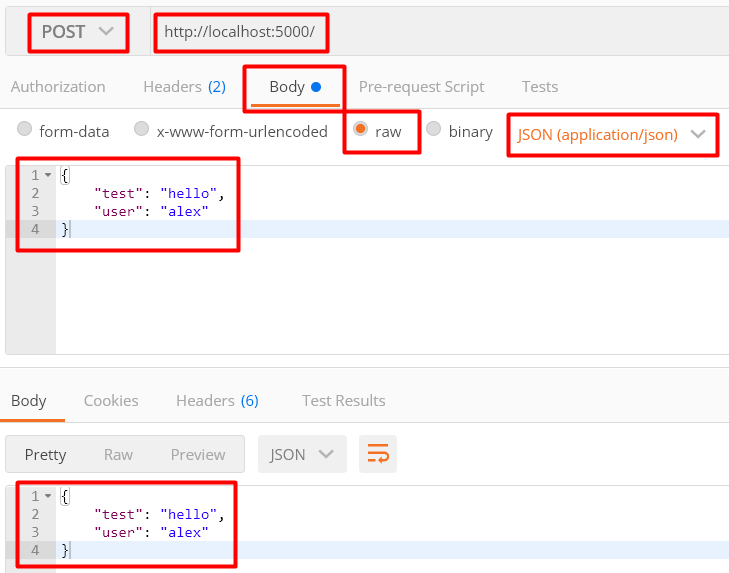

# express - передача данных приложению с помощью метода POST

**HTTP-метод POST** - предназначен для передачи данных приложению.

Данные POST запроса можно получить в `req.body`, но перед этим необходимо вызвать метод express.json(), который будет парсить тело запроса и записывать в `req.body` то, что было передано в запросе.

```js
import express from 'express';

const PORT = 5000;
const app = express();

app.use(express.json()); // <--- Парсим данные в json

app.post('/', (req, res) => {
	let body = req.body; // <--- Получаем тело запроса
	res.json(body);
});

app.listen(PORT, () => { console.log(`Server started at ${PORT} port`)});
```

Переходим в Postman и тестируем запрос:



---

Вместо express.json() можно использовать специальную библиотеку **body-parser**:   
https://github.com/alex-31g/mean-app/blob/master/!_lessons/04.%20body-parser.md
