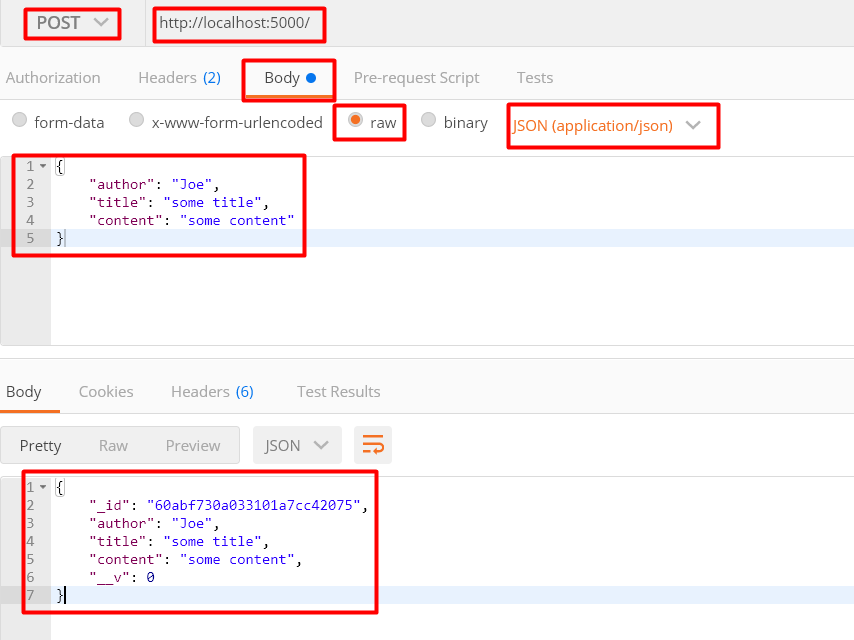

# Модель данных, сохранение в БД

В нашем приложении мы будем создавать посты, у которых будет - автор, заголовок, контент и картинка.   

Модель данных поста описываем в 'Post.js' (модель данных - описание полей и их типов):
```js
import mongoose from 'mongoose';

// Создаем схему, которая будет описывать модель
const Post = new mongoose.Schema({
	author: { type: String, required: true },
	title: { type: String, required: true },
	content: { type: String, required: true },
	picture: { type: String }
})

// 'Post' - имя модели, которая построенна на основании схемы Post
export default mongoose.model('Post', Post);
```

Внутри 'index.js' выполним сохранение данных в БД. Для этого выполним 5 шагов:
```js
// ...
import Post from './Post.js'; // 1. Подключаем модель данных Post

// ...

app.post('/', async (req, res) => {
  try {
    // 2. С помощью деструктиризации из req.body получаем необходимые поля
    const { author, title, content, picture } = req.body;

    // 3. Сохраняем в БД:
    // у модели вызываем метод create, которому передаем объект,
    // соответствующий схеме Post
    const post = await Post.create({ author, title, content, picture });

		// 4. Если данные успешно сохранены в БД -
		// обратно на клиент возвратим пост с id, полученный из БД
    res.json(post);
  } catch (e) {
		// 5. Обработка ошибки
    res.status(500).json(e);
  }
});
```

С помощью Postman выполним отправку тестовых данных и в результате из БД получим ответ с уникальным id:  

